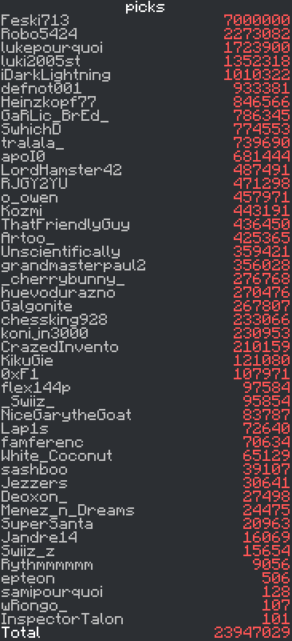

# Scoreboards

View the scoreboard for an objective directly from discord. This plugin generates an image that resembles the in game sidebar.

This will use the first server from the servers list provided in your config.

## Requirements

This plugin requires you to be running [carpet-mod](https://github.com/gnembon/fabric-carpet) on your server and have `commandScript` enabled.
